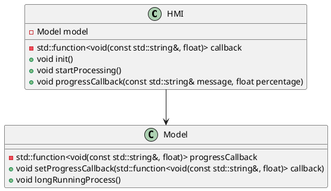
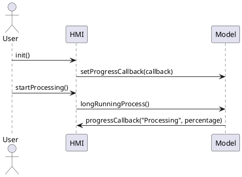

# ProgressCB

ProgressCB est un projet C++ qui illustre l'utilisation de callbacks pour suivre la progression d'un traitement long. Le projet est structuré en deux bibliothèques distinctes : `HMI` et `Model`.

Ce fichier `README.md` fournit une description du projet, de sa structure, des classes principales, et des instructions pour compiler et exécuter le projet. Assurez-vous de remplacer `<URL_DU_DEPOT>` par l'URL réelle de votre dépôt Git si vous en avez un.

## Structure du projet
ProgressCB/ ├── CMakeLists.txt ├── HMI/ │ ├── CMakeLists.txt │ ├── HMI.h │ └── HMI.cpp ├── Model/ │ ├── CMakeLists.txt │ ├── Model.h │ └── Model.cpp ├── main.cpp └── README.md
## Description des classes

### HMI

La classe `HMI` (Human-Machine Interface) est responsable de l'initialisation et du démarrage du traitement. Elle contient une instance de la classe `Model` et définit une callback pour suivre la progression du traitement.

#### Méthodes principales

- `void init()`: Initialise la callback pour suivre la progression.
- `void startProcessing()`: Démarre le traitement long.
- `void progressCallback(const std::string& message, float percentage)`: Callback pour afficher la progression.

### Model

La classe `Model` est responsable de l'exécution du traitement long. Elle accepte une callback pour signaler la progression du traitement.

#### Méthodes principales

- `void setProgressCallback(std::function<void(const std::string&, float)> callback)`: Définit la callback pour suivre la progression.
- `void longRunningProcess()`: Exécute le traitement long et appelle la callback pour signaler la progression.

## Diagramme de classe



## Diagramme de séquence



## Compilation et exécution

### Prérequis

- CMake 3.10 ou supérieur
- Un compilateur C++ compatible avec C++11

### Instructions

1. Cloner le dépôt :

   ```sh
   git clone <URL_DU_DEPOT>
   cd ProgressCB

2. Créer un répertoire de build et générer les fichiers de build avec CMake :
mkdir build
cd build
cmake ..

3. Compiler le projet :
cmake --build .

4. Exécuter l'exécutable généré :
./ProgressCB
